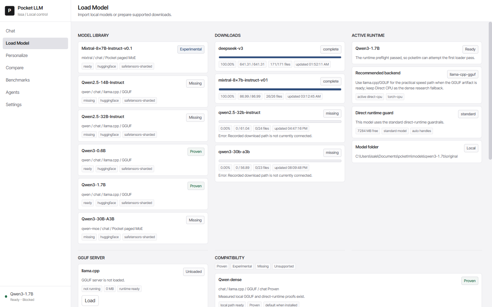

# PocketLM

**A from-scratch LLM inference runtime that runs DeepSeek-V3 (671B parameters) on a consumer Windows laptop, CPU-only.**

Not a wrapper around Ollama, LM Studio, or llama.cpp for the core path — PocketLM
implements its own FP8 kernels, MoE dispatch, weight paging, and speculative decoding,
then proves at runtime that it isn't cheating to get its numbers.



## Headline result

| | |
|---|---|
| Model | DeepSeek-V3, FP8, 61 transformer layers |
| Hardware | Consumer Windows laptop, **CPU-only**, no GPU, no cloud |
| Prompt | `Write exactly ten short words about the sky.` |
| Output | `Blue, vast, endless, clouds, stars,` |
| Speed | **34.23 s / visible token** — down from 569.11 (**16.6×**) |
| Layers executed | 122 / 122 verified |
| Tests | 560 passed, 2 skipped |

Full measured history, component wins, and rejected experiments: **[BENCHMARKS.md](BENCHMARKS.md)**

> **Scope check:** 34 s/token is not a usable chatbot, and this project does not claim
> to be one. The result is that a 671B-parameter model executes *at all* on hardware
> that cannot hold it in RAM, and that it got 16.6× faster through measured,
> individually-proven optimizations. This is a systems and inference-optimization
> project, not a chat product.

## How it works

A 671B FP8 model is ~1.3 TB on disk. The machine has a fraction of that in RAM, so
nothing can be resident. PocketLM addresses that in four layers:

**1. Staged weight streaming.** A persisted tensor catalog and execution plan divide
the model into units scheduled across a *hot* window and a *warm* prefetch window.
Units rotate warm→hot, refill from an overflow head, and residency survives restarts.
Write-time checksums verify the cache on demand.

**2. Native FP8 kernels.** 14 hand-written C++ translation units — FP8 linear, an
AVX-512 FP8 MoE path, MoE dispatch with route-weight combination in C, an attention
bridge, KV cache, and packed GEMV. Every native path has a kill switch and a Python
fallback, so the native contribution is measurable: disabling them takes a full
62-layer pass from `307.894s` to `800.553s`.

**3. Caching.** Exact repeated-prefix reuse (87.085 s → 0.943 s on an 8-layer first
visible token), a full `lm_head` cache (17.585 s → 1.611 s on the cached tail), and a
4096 MB FP8 attention cache under a prefix policy.

**4. MTP speculative decoding.** DeepSeek-V3's own multi-token-prediction head proposes
candidate continuations; the full 61-layer model verifies them in batched sweeps and
remains the only committer. A depth-10 one-pass tree with top-2048 selection now
accepts all 10 visible tokens in a **single** verifier sweep.

### Anti-cheat verification

Speed claims for a 671B model on a laptop are trivially fakeable — skip layers, quietly
drop to Q4, swap in a smaller model, or offload to a GPU. So the runtime instruments
itself and refuses to record a proof unless the work actually happened:

- `layers_executed` must equal `expected_layers_executed` (122/122 on the headline run)
- warm-up runs a separate, independently recorded `61/61` layer proof
- each artifact records `model_id`, quantization, expert routing, and `strategy`
- the verifier contract enforces one weight sweep per pass
- any blocker populates a `blockers` array and invalidates the proof

A change is only promoted to default when `anti_cheat_passed` is true and `blockers` is
empty. [BENCHMARKS.md](BENCHMARKS.md) also lists the optimizations that were built,
measured, and **rejected** for being slower.

## Beyond DeepSeek

PocketLM is also a general local-model control center: import and validation for
Hugging Face, single-safetensor, PyTorch, and GGUF sources; a capability-based
compatibility matrix; Qwen (proven), Mixtral (experimental), Kimi K2 and Gemma 3
(fixture-verified GGUF chat contracts), and a CPU Kronos forecast adapter.

## Install

Requires Python 3.12+ on Windows. **Model weights are never included** and must be
supplied locally.

```powershell
.\install-pocketlm.ps1 -StartApp
```

The installer creates an isolated environment under `%LOCALAPPDATA%\PocketLM\venvs`
(avoiding Windows path-length failures on deep extraction paths) and writes a sanitized
proof to `state\supervisor\install-proof.json`. Relaunch later with `start-pocketlm.ps1`.

PocketLM installs fine with no models. Settings distinguishes a healthy install with no
weights (`partial`) from one with a runnable model (`ready`).

### Development

```powershell
py -3.12 -m venv .venv
.\.venv\Scripts\python.exe -m pip install -e . pytest
.\.venv\Scripts\python.exe -m pytest -q
```

Native kernels build via `python tools/build_native.py --force`, which requires a local
OpenBLAS and copies `libopenblas.dll` next to the built DLLs.

## Installation supervisor

While running, every copy exposes local-only health endpoints:

- `GET http://127.0.0.1:8765/api/supervisor/health` — current sanitized report
- `POST http://127.0.0.1:8765/api/supervisor/check` — run the check, save a proof artifact

Reports use a random installation ID and contain **no** usernames, hostnames, IP
addresses, local paths, prompts, or model contents. Nothing is uploaded automatically.
GitHub Actions runs the same installer and contract checks on a clean Windows runner for
every push.

## Project layout

| Path | Contents |
|---|---|
| `src/pcketlm/core/runtime/` | streaming, FP8 paths, layer bridge, MTP |
| `src/pcketlm/native/` | C++ kernels (FP8, AVX-512 MoE, attention, KV cache) |
| `tools/` | benchmark and proof-generation scripts |
| `state/` | committed JSON proof artifacts |
| `tests/` | 79 test files |

Engineering history lives in [`DECISIONS.md`](DECISIONS.md), [`DONE.md`](DONE.md),
[`ERRORS.md`](ERRORS.md), and [`LOG.md`](LOG.md).

## License

[MIT](LICENSE)
